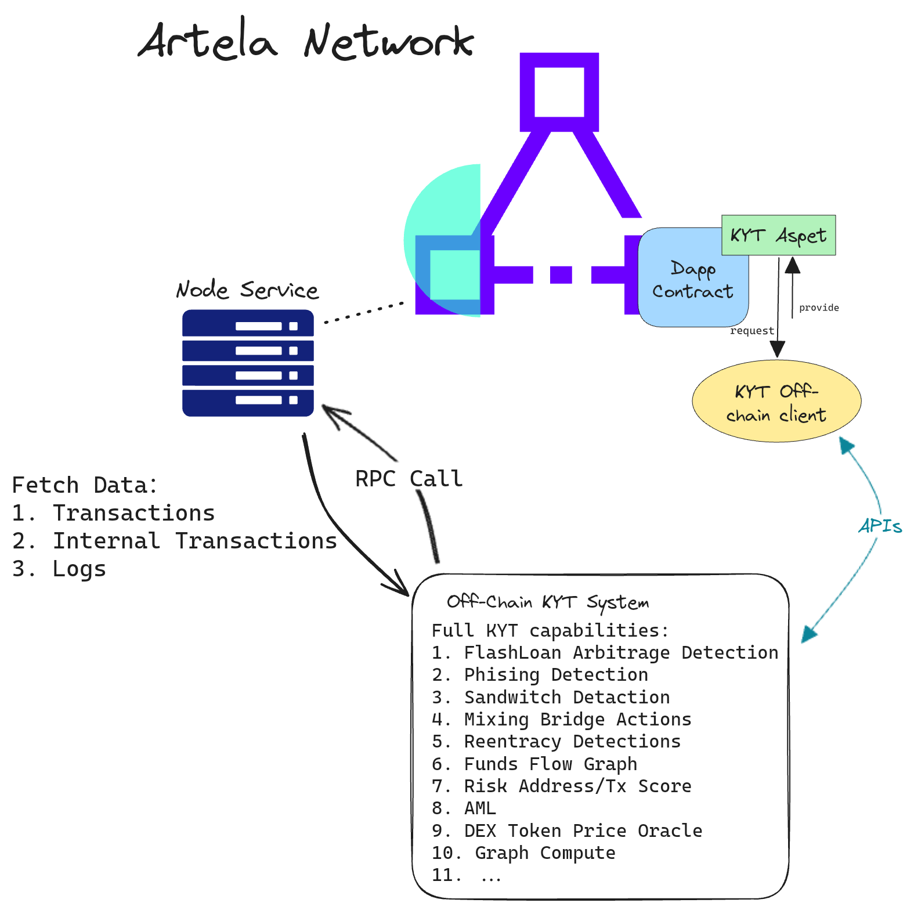
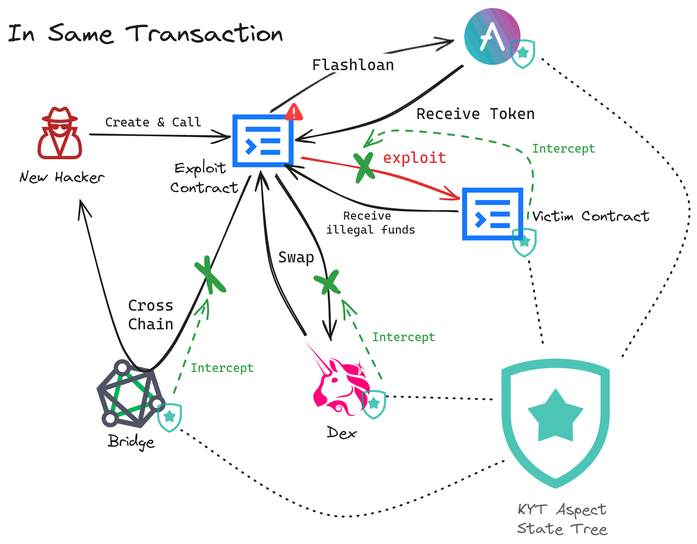
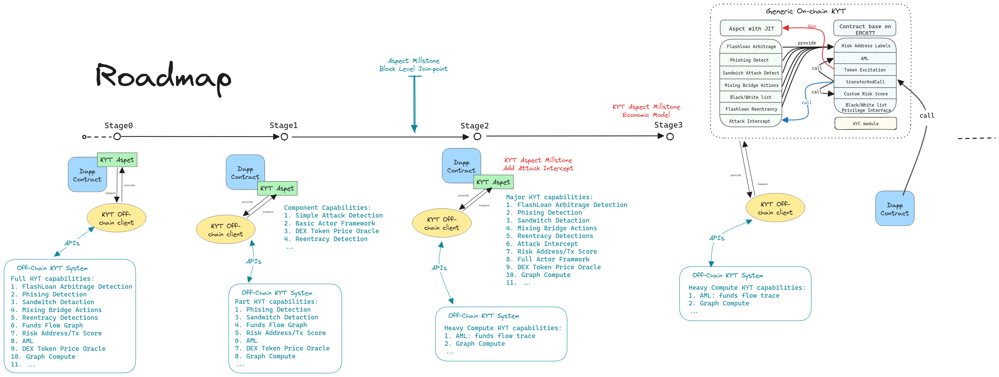

# 通用链上KYT Aspect
Artela Aspect黑客松 ( https://dorahacks.io/hackathon/artela-usecase/detail#-resources ) 

[English](README.md)

黑客松参赛选手:
- 胡云瀚：Architect, Developer, Tester
- 陈阳：Architect, Developer, Tester

## 1.1 项目背景
### 1.1.1 Artela Aspect
Artela的特点是可拓展性强，引入了aspect，也就是用户自定义的拓展，在交易执行的特定环节，会执行这些aspect，借助这个特性，用户可以在artela上创建功能丰富的dapp ( https://docs.artela.network/develop/core-concepts/aspect ) 。

Artela的特色就是在EVM虚拟机上扩展出并行的WASM虚拟机，在WASM虚拟机上可以允许定制化的aspect。aspect可以在artela链原生层执行指令操作，获取到EVM虚拟机上智能合约获取不到的信息，例如交易原始数据、内部交易上下文、日志事件、区块中其他交易数据等。此外，Apsect的WASM虚拟机能以EVM虚拟机两个数量级的速度执行代码任务，从而分担智能合约的gas负担，做到更多更复杂的事情。

<div align="center">
	
</div>

aspect最大的特色在于可以在多个join-point进行hook，其中包括以下3个级别：
- 区块级别
- 交易级别
- 合约调用级别

### 1.1.2 Know Your Transaction/Anti-Money  Laundering
与传统金融领域的KYC相比，Web3链上在客户的身份信息注册方面显得十分困难。因此，在公链上我们更加关注客户地址的动态交易过程。传统金融中KYC是合规监管的必要项目，而**Know Your Transaction(KYT)** 则是在DeFi以及加密资产交易过程中应对风险的必需品，也是未来合规（AML、CFT）监管的主要发展方向。可以根据交易的来源、行为目的、金额、频率等因素，对交易进行风险评估，并及时发现可疑或异常的行为，帮助交易所、钱包等机构识别潜在的洗钱、欺诈、赌博、资产非法转移等违法犯罪活动，并及时采取相应的措施，如警告、冻结、上报等。

**反洗钱(Anti-Money Laundering, AML)** 是当前公链上最迫切的需求之一，也是各国政府、监管机构、团体组织对于金融产品最基本的要求（ https://www.jiemian.com/article/10753197.html ）。每年我们可以看到链上黑客攻击、钓鱼攻击、Rug Pull等安全消息频出，而这些攻击者在非法获取到大量资金后会使用一系列洗钱手段带着非法资金逃之夭夭。在区块链的世界中，几乎不存在类似去银行开户需要提供一大堆身份认证材料的环节，公链项目的参与者可以匿名创建无数个链上地址，这种情况下，仅凭钱包地址我们很难确定对方的真实身份，而反洗钱防范也变得更加困难。2022 年 8 月，美国财政部外国资产控制办公室 (OFAC) 曾制裁混币器 Tornado Cash，据制裁文件显示，Tornado Cash 自 2019 年创建以来已用于清洗价值超过 70 亿美元的加密资产。因此，缺乏有效的监管将严重阻碍区块链行业的健康发展。AML和KYT是并行发展的技术，它们的目的则是降低Web3交易过程中的风险，建立Web3合规这样一个系统工程。

KYT/AML 可以帮助区块链的参与者识别地址和交易存在风险，找到可疑交易关联地址，并能分析该地址追溯到资金流的起点和终点。可疑的交易行为、暗网中的交易地址、它的关联地址们、某个地址在交易所的 KYC 记录等信息可以将链上地址与对应的实体联系起来，从而将匿名的链上世界和实名的线下身份进行链接。KYT/AML产品详细可以参考：https://zan.top/home/know-your-transaction

## 1.2 完全链上通用KYT Aspect方案
针对以上特性，通用链上KYT能力成为可能，具体方案如下：
1. 首先，KYT能力需要对多种不同的Defi项目进行检测分析，并将KYT信息进行共享。而不是针对某个dapp单独进行KYT的适配。因此，链上KYT应该做成通用的模块，每个dapp项目都能以便利的方式进行接入；
2. 当前链下KYT系统主要通过对合约间调用、日志事件分析、地址算法打标等形成了一套风控算法体系。aspect的原生层级hook同样能拿到相应的数据，且能够以较高的效率执行，让通用链上KYT能力成为可能。链上KYT相比链下KYT还能被dapp更加及时地使用，例如，在一笔交易中，风控规则发现了利用闪电贷进行重入攻击的攻击者。当这个攻击者在同一笔交易中想要通过跨链桥进行资产转移时，跨链桥利用链上KYT可以及时将跨链操作进行拦截。
3. 社区贡献：通过aspect可能可以实现链上对洗钱链路的追踪。例如，从tornado cash提取出的一笔标记资金，该资金流的接收地址将被标记成1度风险地址，并存入aspect的世界状态中。在之后的每个区块中，有对该AML aspect进行调用，触发风控规则。该aspect会对整个区块中的资金流进行检查，若发现该1度风险地址有资金流出的行为，那么该资金流的接收地址将被标记成2度风险地址。当然这需要社区对该aspect进行触发，才能执行风控规则。
4. 由于KYT需要对各类风险行为有一个全面的捕获才能更好地提供KYT信息，但由于aspect是需要主动触发才能执行。因此当某个区块如果没有EOA或合约对KYT aspect进行调用的话，是无法触发风控算法的。所以，单单依靠社区贡献是远远不够的。为提高KYT aspect的触发频率，因采取以下措施：
	1. 激励措施：KYT的数据有提供方也有使用方，该模型类似chainlink oracle。因此，可以采用类似ERC677 token标准。当KYT aspect被调用后，发送给调用方token进行奖励。而KYT的使用方，需要使用transferAndCall方式，花钱使用KYT服务。
	2. 合规接入：例如混币器、跨链桥、lending、cex等地址为合规强制接入。
5. 提供 KTC 能力：天然结合KYC，直接触达DeFi项目；
6. 链下KYT改造链上：
	1. 闪电贷套利：在PreTxExecute中处理inputdata并检查是否存在闪电贷操作。然后在PostContractCall检查log和内部交易的资金流，计算地址余额变化。进阶版还能在此步骤通知contract闪电贷套利行为，拦截本次调用操作； 
	2. 三明治攻击：在OnBlockFinalize处运行闪电贷套利算法，检查是否存在三明治攻击。但目前暂未支持上block级别的join-point。 
	3. 中高风险地址转入转出：混币器、混币跨链桥等，在OnBlockInitialize阶段进行一个初步检查，过程参考3的AML方式。然后在PreTxExeute（或OnTxVerify）、PreContractCall进行检查，此处可以拦截风险地址对智能合约发起的调用。最后在PostTxExecute处可以进行检查，过程参考3的AML方式，此时才有token transfer事件发出，更新token转移记录。 
	4. 黑名单/白名单地址行为：流程同上，增加特权接口可以通过外部交易添加黑名单/白名单地址。黑名单包括sanctioned、hacks、phishing等。白名单包括dex、cex、lending等知名项目合约地址，以及知名且通过KYC的EOA地址。
	5. Phishing：在PostTxExecute检查钓鱼行为，并进行拦截。 
	6. 闪电贷重入：已有实现，不做过多赘述。 
	7. 评分算法：评分算法可以自定义权重，权重计算可通过上述算法所产出的地址标签进行计算。


<div align="center">
	
</div>


## 1.3 Artela链上链下混合KYT系统方案
完全链上通用KYT Aspect能够解决当下Off-chain KYT的很多重要问题，例如链上攻击拦截、链上KYT信息共享等。但将全部KYT/AML的能力从线下一步转移到线上也会有出现很多问题，例如 aspect 计算及存储开销、历史交易数据的获取、外部数据源连接等。因此，从中短期规划来看，可以将部分KYT/AML规则和架构放在链上 Aspect 中，复杂算法——例如地址/交易风险评分、Ice Phishing检测等依然使用链下KYT系统进行定期计算，作为 Off-Chain 到 On-Chain KYT的一个过渡性方案，让当前链上Dapp能够快速接入以降低风险和满足AML/CFT合规需求。链下KYT可以使用当前比较成熟的KYT产品API方式进行接入（ https://docs.zan.top/reference/kyt-api-instructions ）。算法产出的KYT数据可以由 data feed provider 定期更新上链，或是使用类似Chainlink语言机的方式提供。从长远来看，Aspect KYT的发展，需要根据Artela Aspect的发展来进行规划，根据Aspect的能力来设计和迭代KYT/AML系统架构。

<div align="center">
	
</div>

## 1.4 KYT使用场景详述
### 1.4.1 KYT目标用户分析
KYT作为一个Public Goods，它的目标用户将会是整个生态中的所有Defi项目及参与者，例如DEX、CEX、Lending、Bridge、Stake、RWA等。尤其是金融属性较强、合规需求高的项目和实体地址，非常适合接入KYT系统。根据风险控制程度、合规要求程度等方面，可以分为以下几类：

1. **监管合规要求高，风险控制程度高**：这类用户基本上是一个链生态的基础设置，或者是处于链生态资金流边缘的项目，拥有大量的用户及交易量。这类项目通常也被犯罪分子用于洗钱，而且也常常成为黑客攻击的目标。例如L1头部跨链桥（stargate）、L2原生跨链桥项目（polygon plasma/pos）以及各类跨链Swap协议，过去的几年里Harmony、Wormhole、Multichain、Socket等多个头部跨链桥遭受黑客攻击，损失惨重。此外，利用跨链桥洗钱的攻击者也数不胜数。中心化交易所（CEX）、Wrapped Native（WETH、WBNB、WMATIC等）、Staking Pool、RWA也是不法分子用来洗钱的途径，这些项目通常需要非常高的合规需求，严厉禁止具有高风险、受制裁、可疑身份的地址与之进行交互。此类用户使用KYT后能够有效地减少高风险地址的交互量，在很大程度上降低安全风险，提高合规性。例如当用户调用跨链桥合约进行跨链时，合约可以调用KYT检查用户地址的风险等级，确认该地址没有风险行为后，才允许其进行资金跨链操作。否则将认定该用户的资金来源非法，还可进一步将资金进行扣押。

2. **风险控制程度高，用户量交易量大**：该类用户受到恶意攻击、MEV 的可能性和频率非常高，是链生态中最常使用，用户和交易量巨大的项目。例如，去中心化交易所（DEX）、去中心化借贷协议（lending）、游戏（Gaming）、博彩（Gambling），这些 defi 协议常常由于新手用户操作产生的滑点而造成了套利空间，导致了很多用户遭到MEV套利损失资金（ https://ethresear.ch/t/empirical-analysis-of-cross-domain-cex-dex-arbitrage-on-ethereum/17620 ）。此外，这些协议也是常见洗钱链路中的一环，例如某些攻击者会提前在lending协议上借出干净的资产，再用黑钱进行偿还。由于DEX、lending这类的协议有大量的用户参与，在AML的过程中资金追踪存在一定的难度，便成了犯罪者们的常用工具。此类项目使用KYT/AML后能够在很大程度上减少非法资金的交易，及时阻断犯罪者的洗钱链路。此外，这类项目的用户也能通过KYT的能力减少被套利、清算的风险。但如果defi项目在具体流程中鼓励使用闪电贷进行套利（如compound v2），则可根据具体情况进行配置。

3. **企业及个人用户，高资产价值**：除了上述种类的Dapp外，企业及个人用户也可以使用KYT进行基础的安全防范，例如AA钱包、CDP、Vault等。这类合约及EOA账户具有高价值资产，且容易遭受Phishing和Rug Pull。例如，用户在链下使用metamask钱包向用户转账或者approve token时，如果wallet接入了KYT系统，则会立即提示用户转账对方的风险程度。对于AA钱包，则需要接入链上KYT Aspect，在进行transfer或approve的时候进行地址风险识别，以拦截风险交易，从而减低收到钓鱼攻击的风险。KYT系统甚至可以通过token是否同名、holder数量及集中程度、相关流动性池的交易量等多种维度，对一个token的风险等级进行评价，指导链上合约识别高风险token，减少Rug Pull风险。

<div align="center">
	
</div>
上图我们可以看到，攻击者在一笔交易中做了3件事情，涉及到了4个项目及合约：

- 首先，攻击者编写并部署了攻击用的智能合约，该合约调用了Aave的闪电贷接口，借到了一笔资金用于攻击准备
- 然后，攻击合约利用受害者合约的漏洞对其进行攻击，并从受害者合约获得了一笔非法收益
- 攻击合约在获利后去到了DEX中进行Swap操作，将资金换成了流通性更强的token
- 最后，攻击合约利用跨链桥将非法资金发送到其他链上，攻击者受控的地址中

在这个简单的模型中，如果我们的所有项目都使用了KYT Aspect，则在以下几处可以进行攻击的拦截：

1. 攻击合约对受害者合约发起攻击时，若Aspect识别到攻击行为，则可以将交易进行回滚；
2. 如果1拦截失败，受害者合约没有接入KYT Aspect，则此时会将攻击合约记录下来，存放在KYT Aspect世界状态中。此时当攻击合约想要去DEX进行swap操作时，DEX会从KYT Aspect中了解到这个风险地址，并进行资金的拦截操作；
3. 如果2拦截失败，受害者合约和DEX都没有接入KYT Aspect，当攻击合约想要去Bridge进行资金跨链操作时，Bridge会从KYT Aspect中了解到这个风险地址，并进行资金的拦截操作；
4. 最后，如果Aave合约也接入了KYT Aspect，那么攻击者在还款过程中也能合约被识别到，从而在**还款操作时对交易进行revert**

### 1.4.2 KYT风险识别介绍
链下KYT系统提供全功能的KYT服务：
1. *闪电贷套利检测*：主要从闪电贷和套利两个维度进行评估。首先，闪电贷是一种便利的借贷方式，要求借贷者在同一笔交易中借出并归还资金，并且利率极低，通常被鼓励用来对各种defi协议进行治理，例如借贷清算（liquidation）。而套利则是日常常见的行为，当两个及以上的流动性池（例如dex pool、lending pool）具有价差时，可观的套利空间通常吸引着无数的最大可提取价值(Maximal extractable value, MEV)的注意。他们通常会采用一系列的MEV策略来平衡流动性池的价差，从中赚取利润，从某种程度上维持生态的健康发展。尽管闪电贷和套利均为日常常见的defi操作，但他们依然会被不法分子用于作恶。几年来，黑客利用智能合约漏洞，通过闪电贷将合约中的资产掏空，造成了数十亿美金的损失。因此，我们可以通过检测闪电贷操作，计算交易发起者（及关联同伙）的总收益，通过比较套利收益的阈值来判断是否是攻击操作。一般而言，MEV以及借贷清算不会产生特别大额的套利收益，除非遇到token价格大幅度下跌的情况（极少发生）。否则，遇上套利收益数百万USD，或是收益率数万倍的情况时，多半是非正常及恶意行为，需要进一步处理防止大量资金的损失。
进一步地，在区块维度中，当一个区块中使用了MEV bot（例如Flashbot），并且同一地址发出了一笔frontrun tx和backrun tx，其中“夹着”一笔受害者发出的交易。根据这一系列的特征，可以检测到区块中是否存在**三明治攻击**。若EOA用户或DEX、lending等协议不希望遭受三明治攻击，则可以使用KYT Aspect进行风险拦截。
2. *钓鱼攻击*：目前链上常见的攻击手段，通常由攻击者生成受害者交互过的地址前后几位相同的地址，并向这些地址进行小额转账或者approve。此时攻击者控制的钓鱼地址将会进入到受害者的转账列表中，若受害者没有仔细检查地址的正确性，则会将资金转入钓鱼地址，造成资金的损失。除此之外，还有各种各样钓鱼的手段不断地被发现。因此，KYT将检测这种恶意行为，在用户受到钓鱼攻击后能够发出提醒，进一步阻止资损。
3. *反洗钱*：反洗钱的核心思想主要是追踪标记资金（即通常所说的黑钱）的流向，在追踪过程中注重准确性，避免无辜地址被标记上。且在追踪过程中需要处理资金的各种变化，例如 native token 转 wrapped native token、多次 swap 操作、债务 token 的消除、peel chain 等。最后，需要指定标记资金 sink 点位，即存在 KYC 的地址，例如 CEX 等。由于 AML 的规则量大，算法处理的情况复杂多样，资金追溯时间可能很长，因此计算量非常大。这样高计算量的一般放到链下进行处理，链上仅存 AML 结果集，即标记资金流动途径中经过的地址集合。
4. *去中心化价格预言机*：该价格预言机主要是为了提供 token 的 usd 价值，以作为 kyt风险识别的重要基础设施。在链下，dex 价格预言机通常使用了同种 token 在不同 dex pool 中的价格的加权平均，有效防止预言机操纵攻击。而在链上，通常使用 TWAP 或者 Chainlink 预言机获取token价格。注意，不能只使用单一价格预言机，需要多种价格预言机组合使用，预防预言机价格操作。
5. *地址/交易风险评分*：对地址/交易进行风险评分时，通常需要对以下多个维度进行加权计算：
- 是否存在与混币器交互行为
- 是否从混币跨链桥提取资金，资金量有多少
- 上游地址是否为极度风险地址（黑客地址、钓鱼地址、诈骗地址等）
- 上游地址是否为中高风险地址，接收资金量有多少
- 是否为闪电贷套利、钓鱼攻击、重入攻击等恶意行为的发起着或同伙
- 是否为制裁地址
- 是否为白名单地址，例如官方DEX Pool、Lending协议抵押凭证等，可用于AML降低误报率
- ......
值得注意的是，地址/交易风险评分模块应给予用户自定义权重的功能。此外，对于不同的Defi类型，还应当设置不同的权重阈值设置方案供用户选择。
6. *图计算*：通过使用图计算引擎，例如TuGraph、Neo4j等，发现*资金流图*（native、ERC20、ERC721、ERC1155转移记录）、合约调用图、合约创建图中的标签传播、社团、标记资金流等价值数据等过程。例如，通过鲁汶算法（Louvain）对资金流图进行社团识别，找出黑客、洗钱团队、诈骗团体的地址，提高AML效率。
KYT系统的能力应该包括但不限于上述的种类，由于篇幅有限，这里仅举其中几例。攻击手法在不断地发生变化，KYT对于风险识别的能力也需要不断地进行提升。详细KYT系统架构、综合能力以及未来的发展欢迎与笔者进行深入讨论。

## 1.5 KYT Aspect发展蓝图
<div align="center">
	
</div>

KYT Aspect按照其链上功能规模可分为至少4个阶段：
1. 阶段0：KYT Aspect主要进行风险地址的有效存储、更新以及发出查询请求log等功能，此外需要提供给使用者基本的调用接口、权限校验、通知路径等基本架构。该阶段KYT Aspect数据来源全由链下KYT系统提供，并由链下的data provider进行定时更新。此架构类似Chainlink预言机，而KYT Aspect则是链上Aggregator的角色。这种架构的好处是能够提供完整的KYT能力，给予用户最基本且完备的KYT服务。然而，其缺点是**无法及时地进行KYT信息共享**，链上链下KYT数据传递还存在一定地时延。
2. 阶段1：这个阶段我们需要在保证提供链下KYT能力的基础上，将部分KYT能力转移到链上，以实现更加及时的KYT信息共享。首先，利用Aspect能在各个Join-point处获取全局数据的特性，开发一些KYT风险识别的简化版算法，之后根据Aspect和链生态的发展以及进行迭代更新，并测试其与链下KYT系统的准确性进行对比。其次，建设基础的用户合约使用流程和接口的开放，搭建好基本的价格预言机系统，确保各项基础设施平稳运行。该阶段是一个**过渡阶段**，这个过程中要去逐步减少对链下KYT能力的依赖，通过发掘Aspect更多的能力去创新风险识别能力。该阶段跟随Aspect的能力一起在发展，由于缺乏更多数据的获取（例如Block级别数据），很多KYT风控算法还无法实现。
3. 阶段2：该阶段是一个里程碑，代表链上KYT能获取到的数据与链下几乎相同（区块级别Join-point、历史状态数据等）。此时，可以将主要的KYT能力从链下迁移到链上，例如钓鱼攻击检测、三明治攻击检测、风险评分体系等。一些大规模计算的任务依旧放在链下，例如完整AML资金流追踪、图计算等。此时，由于较为完备的KYT能力使得风险检测准确性更高，**攻击拦截**这个里程碑式的KYT能力将添加进链上KYT Aspect中。此阶段在KYT风险检测能力上已经能达到与链下KYT产品近乎一样的能力，且具备链下KYT无法完成的攻击拦截能力。
4. 阶段3：在上一阶段的基础上加入例如ERC677等标准的Token合约，打造链上KYT系统的**经济模型**和**去中心治理模型**。从不同类型的Defi角度去适配KYT模块，甚至可以根据不同的项目去打造相应的Router合约，让用户更方便地使用KYT Aspect。该阶段也是一个里程碑，标志着链上KYT Aspect正式商用，并且能够证明其在同类产品中具有较高的竞争力。

## 1.6 KYT Aspect代码详解
### 1.6.1 KYT Aspect主模块
KYT Aspect主要逻辑位于`aspect`目录下的`kytAspect.ts`中。首先，aspect定义了两个Join-point，分别是`preContractCall`和`postTxExecute`。preContractCall主要用于更新token价格等前置操作，这里我们获取了预置的token列表，再通过JIT方式调用合约中的priceOracleAnswer，该方法能够通过TWAP或Chainlink获取token的最新价格。获取到的token价格数据存放到WASM世界状态中。

接下来是postTxExecute中，对资金流进行了简单地处理：
1. 通过`sys.hostApi.runtimeContext.get('receipt.logs')`获取到交易的logs，遍历logs解析ERC20、ERC721的转账情况（之后需要支持上ERC1155）。
2. 通过`sys.hostApi.trace.queryCallTree`获取到交易的内部交易树，通过对内部交易树的遍历，解析出原生art的转账情况。
3. 遍历内部交易树，检测是否存在闪电贷调用。本次支持的闪电贷接口有uniswap v3、balancer、aave v2、aave v3，为闪电贷数量占比较大的闪电贷提供方。后续可以支持dydx、Maker等头部项目的闪电贷协议检测。
4. 通过`buildAddressProfitMap`方法，计算每个关联的地址在这比交易中token的转移情况：
```Typescript
addressBalanceChangeMap: Map<string, Map<string, f64>>
```
EOA/Contract地址 -> (Token 地址 -> 数量)
5. 通过`buildAddressBalanceChangeMap`方法，使用preContractCall中更新好的token价格数据将每个地址的资产变化统一成USD单位。这里需要注意token的decimals，当前默认了都为18，因为是mock的数据，之后需要更加注意每个token的decimals是不同的的。
6. 最后，`checkFlashloanArbitrage`将把上述处理好的数据进行判断，这里其实可以进行风控规则的自定义化，允许用户定义阈值权重。这里由于开发时间有限，暂时设置了一个阈值。

## 1.7 KYT Aspect 示例运行
`aspect`文件夹实现了KYT的部分PoC功能，其中kytAspect为主要逻辑类，实现了简单的闪电贷套利检测Demo以及链上链下KYT数据通道PoC；
`contracts`文件夹实现了链上KYT构想的合约部分功能，主要包含的是业务逻辑，KytToken为主合约。其中，`test`文件夹下包含了一些验证测试用的Mock合约；
`script`文件夹下的`kyt-worker.js`实现了链上链下混合KYT系统的链下部分；
`tests`文件夹下是一些测试用脚本。

前置要求：solidity 版本 >= 0.8.19
1. 将测试用私钥添加到根目录中的privateKey.txt中
2. 初始化项目，安装必要依赖
```shell
npm install
```
3. 编译测试用Solidity智能合约以及KYT Demo Aspect
```shell
npm run contract:build
npm run aspect:build
```
4. 运行`tests`文件夹下的`aspect-deploy.js`，该脚本将会自动部署Kyt token合约、Kyt demo aspect，此外还将部署一个WART token、USDT token、mock dex合约，并转移WART、USDT到mock dex合约中。最后，将发起一笔交易调用Kyt token的transferAndCall方法，参数为mock dex合约，合约将transfer WART token、USDT token给发送者，模拟套利场景。
```shell
cd tests
node aspect-deploy.js
```

5. 运行ZAN KYT后台进程
```shell
# 修改scripts/kyt-worker.js 添加aspectId和ZAN API KEY
vim scripts/kyt-worker.js
node scripts/kyt-worker.js & 
```
架构示意图：

<div align="center">
	
</div>

该进程会轮询aspect请求队列中待查询的地址，然后请求ZAN KYT API，最后将API返回结果存储到Aspect世界状态中

运行截图：
