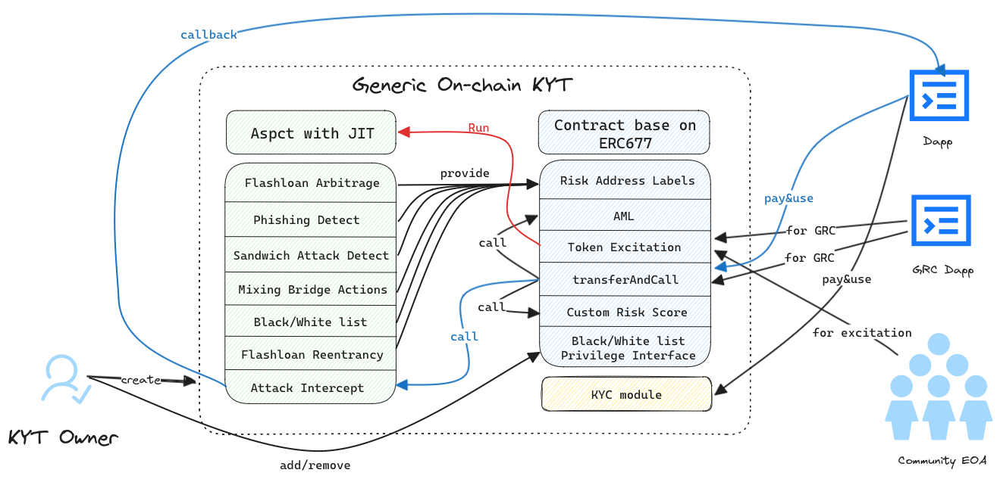
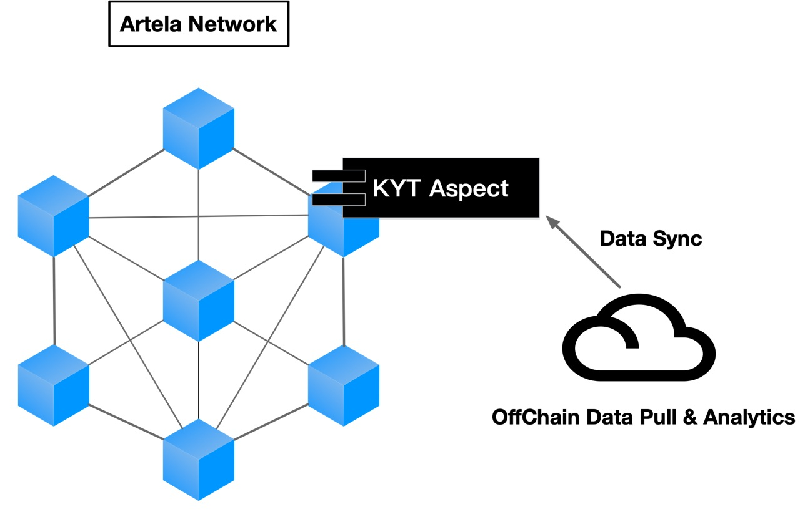
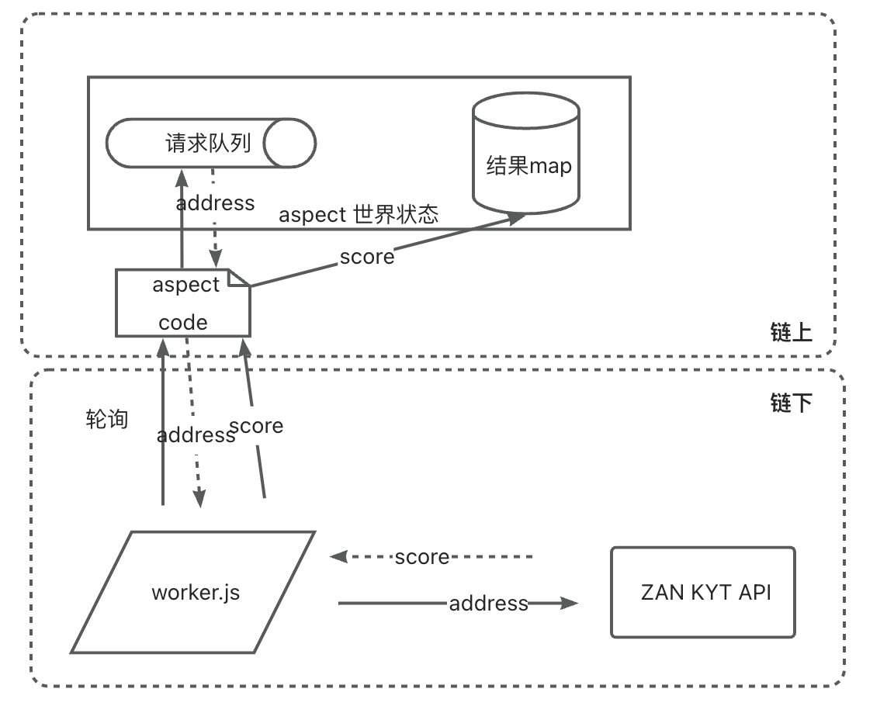
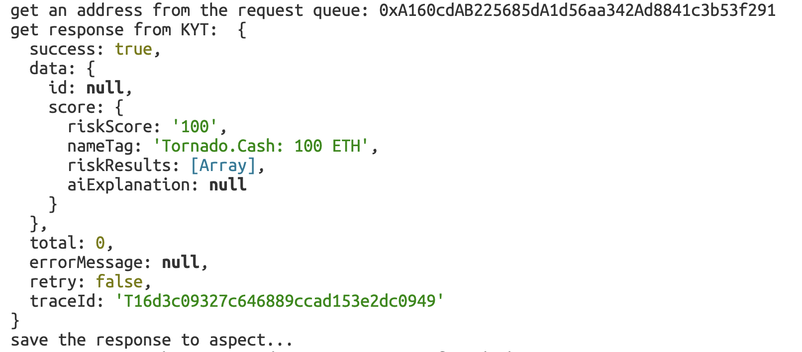
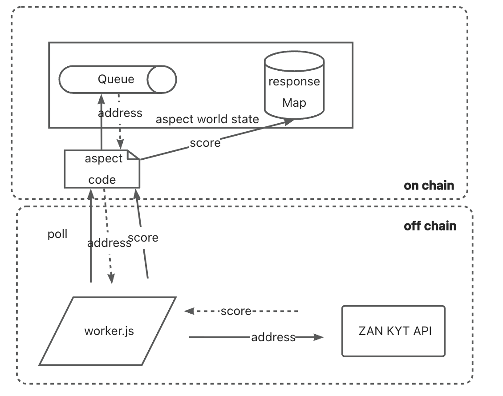

# Generic On-chain KYT Aspect
For Artela Aspect Use Cases Buildathon ( https://dorahacks.io/hackathon/artela-usecase/detail#-resources ) 

黑客松参赛选手(Hackathon Team Members):
- 胡云瀚(Yunhan Hu)：Architect, Developer, Tester
- 陈阳(Yang Chen)：Architect, Developer, Tester

# 1 中文版材料
## 1.1 项目背景
### 1.1.1 Artela Aspect
Artela的特点是可拓展性强，引入了aspect，也就是用户自定义的拓展，在交易执行的特定环节，会执行这些aspect，借助这个特性，用户可以在artela上创建功能丰富的dapp ( https://docs.artela.network/develop/core-concepts/aspect ) 。

Artela的特色就是在EVM虚拟机上扩展出并行的WASM虚拟机，在WASM虚拟机上可以允许定制化的aspect。aspect可以在artela链原生层执行指令操作，获取到EVM虚拟机上智能合约获取不到的信息，例如交易原始数据、内部交易上下文、日志事件、区块中其他交易数据等。此外，Apsect的WASM虚拟机能以EVM虚拟机两个数量级的速度执行代码任务，从而分担智能合约的gas负担，做到更多更复杂的事情。

<div align="center">
	
</div>

aspect最大的特色在于可以在多个join-point进行hook，其中包括以下3个级别：
- 区块级别
- 交易级别
- 合约调用级别

### 1.1.2 Know Your Transaction/Anti-Money  Laundering
与传统金融领域的KYC相比，Web3链上在客户的身份信息注册方面显得十分困难。因此，在公链上我们更加关注客户地址的动态交易过程。传统金融中KYC是合规监管的必要项目，而**Know Your Transaction(KYT)** 则是在DeFi以及加密资产交易过程中应对风险的必需品，也是未来合规（AML、CFT）监管的主要发展方向。可以根据交易的来源、行为目的、金额、频率等因素，对交易进行风险评估，并及时发现可疑或异常的行为，帮助交易所、钱包等机构识别潜在的洗钱、欺诈、赌博、资产非法转移等违法犯罪活动，并及时采取相应的措施，如警告、冻结、上报等。

**反洗钱(Anti-Money Laundering, AML)** 是当前公链上最迫切的需求之一。每年我们可以看到链上黑客攻击、钓鱼攻击、Rug Pull等安全消息频出，而这些攻击者在非法获取到大量资金后会使用一系列洗钱手段带着非法资金逃之夭夭。在区块链的世界中，几乎不存在类似去银行开户需要提供一大堆身份认证材料的环节，公链项目的参与者可以匿名创建无数个链上地址，这种情况下，仅凭钱包地址我们很难确定对方的真实身份，而反洗钱防范也变得更加困难。2022 年 8 月，美国财政部外国资产控制办公室 (OFAC) 曾制裁混币器 Tornado Cash，据制裁文件显示，Tornado Cash 自 2019 年创建以来已用于清洗价值超过 70 亿美元的加密资产。因此，缺乏有效的监管将严重阻碍区块链行业的健康发展。AML和KYT是并行发展的技术，它们的目的则是降低Web3交易过程中的风险，建立Web3合规这样一个系统工程。

KYT/AML 可以帮助区块链的参与者识别地址和交易存在风险，找到可疑交易关联地址，并能分析该地址追溯到资金流的起点和终点。可疑的交易行为、暗网中的交易地址、它的关联地址们、某个地址在交易所的 KYC 记录等信息可以将链上地址与对应的实体联系起来，从而将匿名的链上世界和实名的线下身份进行链接。KYT/AML产品详细可以参考：https://zan.top/home/know-your-transaction

## 1.2 完全链上通用KYT Aspect方案
针对以上特性，通用链上KYT能力成为可能，具体方案如下：
1. 首先，KYT能力需要对多种不同的Defi项目进行检测分析，并将KYT信息进行共享。而不是针对某个dapp单独进行KYT的适配。因此，链上KYT应该做成通用的模块，每个dapp项目都能以便利的方式进行接入；
2. 当前链下KYT系统主要通过对合约间调用、日志事件分析、地址算法打标等形成了一套风控算法体系。aspect的原生层级hook同样能拿到相应的数据，且能够以较高的效率执行，让通用链上KYT能力成为可能。链上KYT相比链下KYT还能被dapp更加及时地使用，例如，在一笔交易中，风控规则发现了利用闪电贷进行重入攻击的攻击者。当这个攻击者在同一笔交易中想要通过跨链桥进行资产转移时，跨链桥利用链上KYT可以及时将跨链操作进行拦截。
3. 社区贡献：通过aspect可能可以实现链上对洗钱链路的追踪。例如，从tornado cash提取出的一笔标记资金，该资金流的接收地址将被标记成1度风险地址，并存入aspect的世界状态中。在之后的每个区块中，有对该AML aspect进行调用，触发风控规则。该aspect会对整个区块中的资金流进行检查，若发现该1度风险地址有资金流出的行为，那么该资金流的接收地址将被标记成2度风险地址。当然这需要社区对该aspect进行触发，才能执行风控规则。
4. 由于KYT需要对各类风险行为有一个全面的捕获才能更好地提供KYT信息，但由于aspect是需要主动触发才能执行。因此当某个区块如果没有EOA或合约对KYT aspect进行调用的话，是无法触发风控算法的。所以，单单依靠社区贡献是远远不够的。为提高KYT aspect的触发频率，因采取以下措施：
	1. 激励措施：KYT的数据有提供方也有使用方，该模型类似chainlink oracle。因此，可以采用类似ERC677 token标准。当KYT aspect被调用后，发送给调用方token进行奖励。而KYT的使用方，需要使用transferAndCall方式，花钱使用KYT服务。
	2. 合规接入：例如混币器、跨链桥、lending、cex等地址为合规强制接入。
5. 提供 KTC 能力：天然结合KYC，直接触达DeFi项目；
6. 链下KYT改造链上：
	1. 闪电贷套利：在PreTxExecute中处理inputdata并检查是否存在闪电贷操作。然后在PostContractCall检查log和内部交易的资金流，计算地址余额变化。进阶版还能在此步骤通知contract闪电贷套利行为，拦截本次调用操作； 
	2. 三明治攻击：在OnBlockFinalize处运行闪电贷套利算法，检查是否存在三明治攻击。但目前暂未支持上block级别的join-point。 
	3. 中高风险地址转入转出：混币器、混币跨链桥等，在OnBlockInitialize阶段进行一个初步检查，过程参考3的AML方式。然后在PreTxExeute（或OnTxVerify）、PreContractCall进行检查，此处可以拦截风险地址对智能合约发起的调用。最后在PostTxExecute处可以进行检查，过程参考3的AML方式，此时才有token transfer事件发出，更新token转移记录。 
	4. 黑名单/白名单地址行为：流程同上，增加特权接口可以通过外部交易添加黑名单/白名单地址。黑名单包括sanctioned、hacks、phishing等。白名单包括dex、cex、lending等知名项目合约地址，以及知名且通过KYC的EOA地址。
	5. Phishing：在PostTxExecute检查钓鱼行为，并进行拦截。 
	6. 闪电贷重入：已有实现，不做过多赘述。 
	7. 评分算法：评分算法可以自定义权重，权重计算可通过上述算法所产出的地址标签进行计算。


<div align="center">
	
</div>


## 1.3 Artela链上链下混合KYT系统方案
完全链上通用KYT Aspect能够解决当下Off-chain KYT的很多重要问题，例如链上攻击拦截、链上KYT信息共享等。但将全部KYT/AML的能力从线下一步转移到线上也会有出现很多问题，例如 aspect 计算及存储开销、历史交易数据的获取、外部数据源连接等。因此，从中短期规划来看，可以将部分KYT/AML规则和架构放在链上 Aspect 中，复杂算法——例如地址/交易风险评分、Ice Phishing检测等依然使用链下KYT系统进行定期计算，作为 Off-Chain 到 On-Chain KYT的一个过渡性方案，让当前链上Dapp能够快速接入以降低风险和满足AML/CFT合规需求。链下KYT可以使用当前比较成熟的KYT产品API方式进行接入（ https://docs.zan.top/reference/kyt-api-instructions ）。算法产出的KYT数据可以由 data feed provider 定期更新上链，或是使用类似Chainlink语言机的方式提供。从长远来看，Aspect KYT的发展，需要根据Artela Aspect的发展来进行规划，根据Aspect的能力来设计和迭代KYT/AML系统架构。

<div align="center">
	
</div>

## 1.4 KYT Aspect 示例运行
`aspect`文件夹实现了KYT的部分PoC功能，其中kytAspect为主要逻辑类，实现了简单的闪电贷套利检测Demo以及链上链下KYT数据通道PoC；
`contracts`文件夹实现了链上KYT构想的合约部分功能，主要包含的是业务逻辑，KytToken为主合约。其中，`test`文件夹下包含了一些验证测试用的Mock合约；
`script`文件夹下的`kyt-worker.js`实现了链上链下混合KYT系统的链下部分；
`tests`文件夹下是一些测试用脚本。

前置要求：solidity 版本 >= 0.8.19
1. 将测试用私钥添加到根目录中的privateKey.txt中
2. 初始化项目，安装必要依赖
```shell
npm install
```
3. 编译测试用Solidity智能合约以及KYT Demo Aspect
```shell
npm run contract:build
npm run aspect:build
```
4. 运行`tests`文件夹下的`aspect-deploy.js`，该脚本将会自动部署Kyt token合约、Kyt demo aspect，此外还将部署一个WART token、USDT token、mock dex合约，并转移WART、USDT到mock dex合约中。最后，将发起一笔交易调用Kyt token的transferAndCall方法，参数为mock dex合约，合约将transfer WART token、USDT token给发送者，模拟套利场景。
```shell
cd tests
node aspect-deploy.js
```

5. 运行ZAN KYT后台进程
```shell
# 修改scripts/kyt-worker.js 添加aspectId和ZAN API KEY
vim scripts/kyt-worker.js
node scripts/kyt-worker.js & 
```
架构示意图：

<div align="center">
	
</div>

该进程会轮询aspect请求队列中待查询的地址，然后请求ZAN KYT API，最后将API返回结果存储到Aspect世界状态中

运行截图：


# 2 English Version
## 2.1 Background
### 2.1.1 Artela Aspect
The feature of Artela lies in its strong scalability, introducing aspects, which are user-defined extensions. At specific stages of transaction execution, these aspects are executed. Leveraging this feature, users can create feature-rich decentralized applications (dApps) on Artela ( https://docs.artela.network/develop/core-concepts/aspect ).

Artela's distinctive feature is the extension of a parallel WASM (WebAssembly) virtual machine on the EVM (Ethereum Virtual Machine). Customizable aspects can be allowed on the WASM virtual machine. Aspects can execute instruction operations at the native layer of the Artela chain, obtaining information that smart contracts on the EVM virtual machine cannot access, such as raw transaction data, internal transaction context, log events, and other transaction data in the block. Additionally, the WASM virtual machine for aspects can execute code tasks at a speed two orders of magnitude faster than the EVM virtual machine. This capability helps alleviate the gas burden on smart contracts, enabling them to perform more complex tasks.

<div align="center">
	
</div>

The most notable feature of aspects is the ability to hook at multiple join points, including three levels:
- Block level (currently not supported)
- Transaction level
- Contract call level

### 2.1.2 Know Your Transaction/Anti-Money  Laundering
Compared to traditional financial KYC, it is considerably challenging to register customer identity information on the Web3 blockchain. Therefore, on public blockchains, we pay more attention to the dynamic transaction processes of customer addresses. In traditional finance, KYC is a necessary part of compliance and regulation, while **Know Your Transaction (KYT)** is an essential tool for managing risks in DeFi and cryptocurrency transactions, and it represents the primary direction for future compliance (AML, CFT) regulation. One can assess the risk of transactions based on factors such as the source, intended behavior, amount, frequency, etc., and promptly identify suspicious or abnormal activities. This helps exchanges, wallets, and other institutions to detect potential illegal activities such as money laundering, fraud, gambling, or unlawful asset transfers, and to take appropriate measures in a timely manner, such as issuing warnings, freezing assets, or reporting to authorities.

**Anti-Money Laundering (AML)** is one of the most pressing needs on public blockchains today. Every year we see a frequent occurrence of security incidents such as on-chain hacker attacks, phishing attacks, and Rug Pulls, and the attackers involved in these incidents often use a series of money laundering tactics to abscond with the illegally obtained funds. In the world of blockchain, there is almost no process similar to the one in banks where a multitude of identity verification documents are required to open an account. Participants in public blockchain projects can anonymously create an unlimited number of on-chain addresses, making it very difficult to ascertain the true identity of a party based solely on a wallet address, hence making AML prevention more challenging. In August 2022, the U.S. Treasury Department's Office of Foreign Assets Control (OFAC) sanctioned the cryptocurrency mixer Tornado Cash. According to the sanction documents, since its inception in 2019, Tornado Cash had been used to launder more than $7 billion worth of cryptocurrency. Therefore, the lack of effective regulation could seriously hinder the healthy development of the blockchain industry. AML and KYT are technologies that are developing in parallel, and their aim is to reduce the risks involved in Web3 transactions and to establish a systematic engineering approach to Web3 compliance.

KYT/AML can help participants in the blockchain ecosystem identify risks associated with addresses and transactions, locate suspicious transaction-related addresses, and analyze these addresses to trace the origin and destination of funds flows. Information such as suspicious transaction behaviors, dark web transaction addresses, their associated addresses, and KYC records of an address at an exchange can link on-chain addresses to corresponding real-world entities, thus bridging the gap between the anonymous on-chain world and real-world identities. For detailed information on KYT/AML products, please refer to:  https://zan.top/home/know-your-transaction

## 2.2 Generic On-chain KYT Aspect Schema
These features are currently not achievable in typical EVM smart contracts, making universal on-chain Know Your Transaction (KYT) capabilities possible. The specific plan is as follows:

1. **Universal Module for KYT:** KYT capabilities need to analyze and detect various DeFi projects, sharing KYT information rather than adapting it separately for each dApp. Therefore, on-chain KYT should be a universal module that every dApp project can easily integrate.

2. **Efficient KYT Execution:** The current off-chain KYT system primarily uses contract interaction, log event analysis, address algorithm labeling, etc., to form a risk control algorithm system. The native-level hook of aspects can obtain corresponding data with high efficiency, making universal on-chain KYT capabilities possible. On-chain KYT can be more promptly used by dApps. For example, if a risk rule detects an attacker using a flash loan for a reentrancy attack in a transaction, the on-chain KYT can intercept cross-chain operations by the attacker in the same transaction.

3. **Community Contribution:** Through aspects, on-chain tracking of money laundering routes may be possible. For instance, funds extracted from Tornado Cash could be marked as risky in the aspect's world state. In each subsequent block, calls to the AML aspect would trigger risk control rules, checking fund flows in the entire block. If there is an outflow from the marked risky address, the receiving address of that fund flow would be marked as a second-degree risky address (similar to off-chain, excluding DEX and other hot addresses). This requires community contributions to trigger the aspect and execute risk control rules.

4. **Increasing KYT Aspect Trigger Frequency:** Since KYT needs comprehensive capture of various risk behaviors, and aspects need to be actively triggered to execute, if a block doesn't have an External Owned Account (EOA) or contract calling the KYT aspect, the risk control algorithm won't be triggered. To enhance the trigger frequency of KYT aspects, the following measures can be taken:
	1. **Incentives:** Similar to the Chainlink oracle model, provide incentives by sending tokens to the calling party as a reward when the KYT aspect is invoked.
	2. **Compliance Integration:** Addresses such as mixers, cross-chain bridges, lending platforms, centralized exchanges (CEX), etc., should be compelled to integrate with KYT aspects for compliance reasons, ensuring broader adoption.

5. **Provide KYT Capability** : Naturally integrating KYC, directly accessing DeFi projects.
6. **Off-Chain KYT Transformation to On-Chain:**
	1. **Arbitrage:** Process input data in PreTxExecute, checking for flash loan operations. Then, in PostContractCall, examine the fund flow in logs and internal transactions, calculating address balance changes. An advanced version can notify the contract of flash loan arbitrage behavior at this step, intercepting the current call operation.
	2. **Sandwich Attacks:** Run a flash loan arbitrage algorithm at OnBlockFinalize, checking for sandwich attacks. Currently, block-level join-points are not supported.
	3. **Inflow and Outflow from Medium-to-High-Risk Addresses:** For mixers, cross-chain bridges, etc., perform an initial check in the OnBlockInitialize phase, following the AML method outlined in point 3. Then, check in PreTxExecute (or OnTxVerify) and PreContractCall, where you can intercept calls from risky addresses to smart contracts. Finally, perform checks in PostTxExecute, following the AML method in point 3, when token transfer events are emitted, updating token transfer records.
	4. **Behavior of Blacklisted/Whitelisted Addresses:** Similar process as above, with the addition of a privileged interface to add blacklisted/whitelisted addresses via external transactions. The blacklist includes sanctioned, hacks, phishing, etc. The whitelist includes addresses of well-known projects, such as DEX, CEX, lending, and reputable addresses verified through KYC.
	5. **Phishing:** Check for phishing behavior in PostTxExecute and intercept accordingly.
	6. **Flash Loan Reentrancy:** Already implemented, no need for further elaboration.
	7. **Scoring Algorithm:** The scoring algorithm allows custom weights, and weight calculation can be done using the address labels generated by the above algorithms.

<div align="center">
	
</div>

## 2.3 Artela Hybrid On-Chain and Off-Chain KYT System Schema
A fully on-chain, generic KYT Aspect can solve many significant issues currently faced by off-chain KYT, such as on-chain attack interception and on-chain KYT information sharing. However, transitioning all KYT/AML capabilities from offline to online in one step would also present many challenges, such as computational and storage expenses for the aspect, acquisition of historical transaction data, and connecting to external data sources. Therefore, from a short to medium-term planning perspective, it's feasible to implement some of the KYT/AML rules and architecture on the on-chain Aspect. Complex algorithms—for instance, address/transaction risk scoring, Ice Phishing detection—would still be processed off-chain in the KYT system on a regular basis. This can serve as a transitional solution from Off-Chain to On-Chain KYT, allowing current on-chain Dapps to quickly integrate and reduce risks while meeting AML/CFT compliance requirements. Off-chain KYT can utilize the APIs of currently mature KYT products for integration.（ https://docs.zan.top/reference/kyt-api-instructions ）。The KYT data produced by the algorithm can be regularly updated on-chain by a data feed provider, or provided using a mechanism similar to Chainlink oracles. In the long term, the development of Aspect KYT needs to be planned according to the progress of Artela Aspect, with the KYT/AML system architecture designed and iterated based on Aspect's capabilities.

<div align="center">
	
</div>

## 2.4 Run KYT Aspect Demo
The `aspect` folder implements some PoC functionalities for KYT, where kytAspect is the main logic class. It provides a simple flash loan arbitrage detection demo as well as a Proof of Concept for on-chain and off-chain KYT data channels;
The `contracts` folder implements the on-chain part of the KYT concept, mainly containing business logic, with KytToken being the primary contract. Within this, the test folder includes some mock contracts used for verification testing;
Under the `script` folder, `kyt-worker.js` implements the off-chain part of the mixed on-chain and off-chain KYT system;
The `tests` folder contains some scripts for testing purposes.

Prerequisite: Solidity version >= 0.8.19

1. Add the test private key to the privateKey.txt in the root directory.
2. Initialize the project and install necessary dependencies.
```shell
npm install
```
3. Compile the test Solidity smart contract and the KYT Demo Aspect.
```shell
npm run contract:build
npm run aspect:build
```
4. Run the `aspect-deploy.js` script located in the `tests` folder. This script will automatically deploy the Kyt token contract and the Kyt demo aspect. Additionally, it will deploy a WART token, a USDT token, and a mock DEX contract, and then transfer WART and USDT tokens into the mock DEX contract. Finally, it will initiate a transaction to call the `transferAndCall` method of the Kyt token, with the mock DEX contract as the parameter. The contract will transfer WART tokens and USDT tokens back to the sender, simulating an arbitrage scenario.
```shell
cd tests
node aspect-deploy.js
```

5. Run KYT API worker
```shell
# modify scripts/kyt-worker.js to add the aspectId and a ZAN API KEY
vim scripts/kyt-worker.js
node scripts/kyt-worker.js & 
```

architecture：
<div align="center">
	
</div>

The process will poll the address to the aspect request queue, then request the ZAN KYT API, and finally store the API response in the aspect world state.

screenshot：
