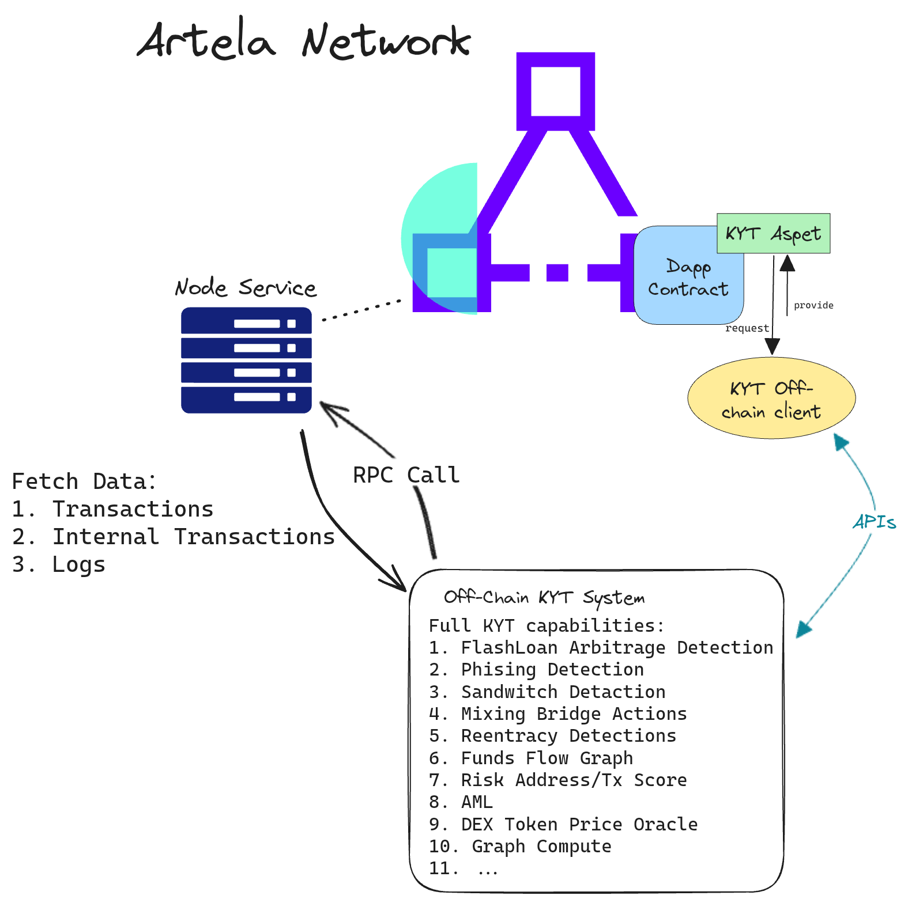

# Generic On-chain KYT Aspect
For Artela Aspect Use Cases Buildathon ( https://dorahacks.io/hackathon/artela-usecase/detail#-resources ) 

Hackathon Team Members:
- Yunhan Hu：Architect, Developer, Tester
- Yang Chen：Architect, Developer, Tester

## 1.1 Background
### 1.1.1 Artela Aspect
The feature of Artela lies in its strong scalability, introducing aspects, which are user-defined extensions. At specific stages of transaction execution, these aspects are executed. Leveraging this feature, users can create feature-rich decentralized applications (dApps) on Artela ( https://docs.artela.network/develop/core-concepts/aspect ).

Artela's distinctive feature is the extension of a parallel WASM (WebAssembly) virtual machine on the EVM (Ethereum Virtual Machine). Customizable aspects can be allowed on the WASM virtual machine. Aspects can execute instruction operations at the native layer of the Artela chain, obtaining information that smart contracts on the EVM virtual machine cannot access, such as raw transaction data, internal transaction context, log events, and other transaction data in the block. Additionally, the WASM virtual machine for aspects can execute code tasks at a speed two orders of magnitude faster than the EVM virtual machine. This capability helps alleviate the gas burden on smart contracts, enabling them to perform more complex tasks.

<div align="center">
	
</div>

The most notable feature of aspects is the ability to hook at multiple join points, including three levels:
- Block level (currently not supported)
- Transaction level
- Contract call level

### 1.1.2 Know Your Transaction/Anti-Money  Laundering
Compared to traditional financial KYC, it is considerably challenging to register customer identity information on the Web3 blockchain. Therefore, on public blockchains, we pay more attention to the dynamic transaction processes of customer addresses. In traditional finance, KYC is a necessary part of compliance and regulation, while **Know Your Transaction (KYT)** is an essential tool for managing risks in DeFi and cryptocurrency transactions, and it represents the primary direction for future compliance (AML, CFT) regulation. One can assess the risk of transactions based on factors such as the source, intended behavior, amount, frequency, etc., and promptly identify suspicious or abnormal activities. This helps exchanges, wallets, and other institutions to detect potential illegal activities such as money laundering, fraud, gambling, or unlawful asset transfers, and to take appropriate measures in a timely manner, such as issuing warnings, freezing assets, or reporting to authorities.

**Anti-Money Laundering (AML)** is one of the most pressing needs on public blockchains today. Every year we see a frequent occurrence of security incidents such as on-chain hacker attacks, phishing attacks, and Rug Pulls, and the attackers involved in these incidents often use a series of money laundering tactics to abscond with the illegally obtained funds. In the world of blockchain, there is almost no process similar to the one in banks where a multitude of identity verification documents are required to open an account. Participants in public blockchain projects can anonymously create an unlimited number of on-chain addresses, making it very difficult to ascertain the true identity of a party based solely on a wallet address, hence making AML prevention more challenging. In August 2022, the U.S. Treasury Department's Office of Foreign Assets Control (OFAC) sanctioned the cryptocurrency mixer Tornado Cash. According to the sanction documents, since its inception in 2019, Tornado Cash had been used to launder more than $7 billion worth of cryptocurrency. Therefore, the lack of effective regulation could seriously hinder the healthy development of the blockchain industry. AML and KYT are technologies that are developing in parallel, and their aim is to reduce the risks involved in Web3 transactions and to establish a systematic engineering approach to Web3 compliance.

KYT/AML can help participants in the blockchain ecosystem identify risks associated with addresses and transactions, locate suspicious transaction-related addresses, and analyze these addresses to trace the origin and destination of funds flows. Information such as suspicious transaction behaviors, dark web transaction addresses, their associated addresses, and KYC records of an address at an exchange can link on-chain addresses to corresponding real-world entities, thus bridging the gap between the anonymous on-chain world and real-world identities. For detailed information on KYT/AML products, please refer to:  https://zan.top/home/know-your-transaction

## 1.2 Generic On-chain KYT Aspect Schema
These features are currently not achievable in typical EVM smart contracts, making universal on-chain Know Your Transaction (KYT) capabilities possible. The specific plan is as follows:

1. **Universal Module for KYT:** KYT capabilities need to analyze and detect various DeFi projects, sharing KYT information rather than adapting it separately for each dApp. Therefore, on-chain KYT should be a universal module that every dApp project can easily integrate.

2. **Efficient KYT Execution:** The current off-chain KYT system primarily uses contract interaction, log event analysis, address algorithm labeling, etc., to form a risk control algorithm system. The native-level hook of aspects can obtain corresponding data with high efficiency, making universal on-chain KYT capabilities possible. On-chain KYT can be more promptly used by dApps. For example, if a risk rule detects an attacker using a flash loan for a reentrancy attack in a transaction, the on-chain KYT can intercept cross-chain operations by the attacker in the same transaction.

3. **Community Contribution:** Through aspects, on-chain tracking of money laundering routes may be possible. For instance, funds extracted from Tornado Cash could be marked as risky in the aspect's world state. In each subsequent block, calls to the AML aspect would trigger risk control rules, checking fund flows in the entire block. If there is an outflow from the marked risky address, the receiving address of that fund flow would be marked as a second-degree risky address (similar to off-chain, excluding DEX and other hot addresses). This requires community contributions to trigger the aspect and execute risk control rules.

4. **Increasing KYT Aspect Trigger Frequency:** Since KYT needs comprehensive capture of various risk behaviors, and aspects need to be actively triggered to execute, if a block doesn't have an External Owned Account (EOA) or contract calling the KYT aspect, the risk control algorithm won't be triggered. To enhance the trigger frequency of KYT aspects, the following measures can be taken:
	1. **Incentives:** Similar to the Chainlink oracle model, provide incentives by sending tokens to the calling party as a reward when the KYT aspect is invoked.
	2. **Compliance Integration:** Addresses such as mixers, cross-chain bridges, lending platforms, centralized exchanges (CEX), etc., should be compelled to integrate with KYT aspects for compliance reasons, ensuring broader adoption.

5. **Provide KYT Capability** : Naturally integrating KYC, directly accessing DeFi projects.
6. **Off-Chain KYT Transformation to On-Chain:**
	1. **Arbitrage:** Process input data in PreTxExecute, checking for flash loan operations. Then, in PostContractCall, examine the fund flow in logs and internal transactions, calculating address balance changes. An advanced version can notify the contract of flash loan arbitrage behavior at this step, intercepting the current call operation.
	2. **Sandwich Attacks:** Run a flash loan arbitrage algorithm at OnBlockFinalize, checking for sandwich attacks. Currently, block-level join-points are not supported.
	3. **Inflow and Outflow from Medium-to-High-Risk Addresses:** For mixers, cross-chain bridges, etc., perform an initial check in the OnBlockInitialize phase, following the AML method outlined in point 3. Then, check in PreTxExecute (or OnTxVerify) and PreContractCall, where you can intercept calls from risky addresses to smart contracts. Finally, perform checks in PostTxExecute, following the AML method in point 3, when token transfer events are emitted, updating token transfer records.
	4. **Behavior of Blacklisted/Whitelisted Addresses:** Similar process as above, with the addition of a privileged interface to add blacklisted/whitelisted addresses via external transactions. The blacklist includes sanctioned, hacks, phishing, etc. The whitelist includes addresses of well-known projects, such as DEX, CEX, lending, and reputable addresses verified through KYC.
	5. **Phishing:** Check for phishing behavior in PostTxExecute and intercept accordingly.
	6. **Flash Loan Reentrancy:** Already implemented, no need for further elaboration.
	7. **Scoring Algorithm:** The scoring algorithm allows custom weights, and weight calculation can be done using the address labels generated by the above algorithms.

<div align="center">
	
</div>

## 1.3 Artela Hybrid On-Chain and Off-Chain KYT System Schema
A fully on-chain, generic KYT Aspect can solve many significant issues currently faced by off-chain KYT, such as on-chain attack interception and on-chain KYT information sharing. However, transitioning all KYT/AML capabilities from offline to online in one step would also present many challenges, such as computational and storage expenses for the aspect, acquisition of historical transaction data, and connecting to external data sources. Therefore, from a short to medium-term planning perspective, it's feasible to implement some of the KYT/AML rules and architecture on the on-chain Aspect. Complex algorithms—for instance, address/transaction risk scoring, Ice Phishing detection—would still be processed off-chain in the KYT system on a regular basis. This can serve as a transitional solution from Off-Chain to On-Chain KYT, allowing current on-chain Dapps to quickly integrate and reduce risks while meeting AML/CFT compliance requirements. Off-chain KYT can utilize the APIs of currently mature KYT products for integration.（ https://docs.zan.top/reference/kyt-api-instructions ）。The KYT data produced by the algorithm can be regularly updated on-chain by a data feed provider, or provided using a mechanism similar to Chainlink oracles. In the long term, the development of Aspect KYT needs to be planned according to the progress of Artela Aspect, with the KYT/AML system architecture designed and iterated based on Aspect's capabilities.

<div align="center">
	
</div>

## 1.4 Detailed Explanation of KYT Use Cases
### 1.4.1 Analysis of KYT Target Users
KYT, being a Public Good, is aimed at all participants and projects within the entire ecosystem, such as DEXes, CEXes, Lending platforms, Bridges, Staking, Real-World Assets (RWAs), etc. Projects and entities with strong financial attributes and high compliance demands are particularly suitable for integrating with the KYT system. Based on the level of risk control and compliance requirements, they can be categorized into the following types:

1. **High Regulatory Compliance and Risk Control Requirements**: These users form the foundational setup of a blockchain ecosystem or are projects at the periphery of the ecosystem's capital flow, with a large user base and transaction volume. Such projects are often targeted for money laundering by criminals and are frequent targets of hacking attacks. For instance, top-tier Layer 1 cross-chain bridges (e.g., Stargate), native Layer 2 cross-chain bridge projects (e.g., Polygon Plasma/POS), and various cross-chain Swap protocols have suffered heavy losses due to hacker attacks over the past few years, including Harmony, Wormhole, Multichain, Socket, etc. Additionally, attackers have exploited these bridges for laundering money on numerous occasions. Centralized exchanges (CEXes), Wrapped Natives (e.g., WETH, WBNB, WMATIC), Staking Pools, and RWAs are also channels used by criminals for laundering money. These projects typically have very high compliance requirements, strictly prohibiting interactions with high-risk, sanctioned, or suspicious addresses. Users integrating KYT can effectively reduce interactions with high-risk addresses, significantly lowering security risks and enhancing compliance. For example, when a user invokes a cross-chain bridge contract for transferring assets, the contract can use KYT to check the risk level of the user's address. Only after confirming that the address does not exhibit risky behavior, the contract allows the cross-chain capital operation. Otherwise, the user's source of funds may be considered illegal, and further measures such as asset seizure can be taken.

2. **High Degree of Risk Control, Large User and Transaction Volume**: Users in this category face a high possibility and frequency of malicious attacks and Maximum Extractable Value (MEV) incidents. They are part of the most frequently used projects in the blockchain ecosystem, with a significant user base and transaction volume. For instance, decentralized exchanges (DEXes), decentralized lending protocols (lending), gaming, and gambling platforms often create arbitrage opportunities due to slippage from novice user operations, resulting in many users losing funds to MEV arbitrage ( https://ethresear.ch/t/empirical-analysis-of-cross-domain-cex-dex-arbitrage-on-ethereum/17620 ). Moreover, these protocols often form part of common money laundering routes, such as attackers borrowing clean assets on lending protocols and repaying with illicit funds. Because DEX and lending protocols involve a large number of users, tracking funds in the AML process can be challenging, making them a tool commonly used by criminals. The integration of KYT/AML can substantially reduce transactions involving illegal funds and promptly disrupt criminals' money laundering routes for such projects. Additionally, users of these projects can also reduce the risks of being arbitraged or liquidated through the capabilities provided by KYT. However, if a DeFi project encourages the use of flash loans for arbitrage within its processes (e.g., Compound v2), it can be configured according to specific circumstances.

3. **Corporate and Individual Users with High-Value Assets**: In addition to the types of DApps mentioned above, corporate and individual users can also use KYT for basic security precautions, such as AA wallets, Collateralized Debt Positions (CDPs), Vaults, etc. These contract and Externally Owned Account (EOA) addresses hold high-value assets and are susceptible to phishing and rug pulls. For example, when a user makes a transfer or approves a token using a MetaMask wallet off-chain, if the wallet has integrated KYT, it will immediately alert the user to the risk level of the receiving address. For AA wallets, on-chain KYT Aspects need to be integrated to identify address risks during transfers or approvals to intercept risky transactions, thereby reducing the risk of phishing attacks. The KYT system can even assess the risk level of a token through various dimensions such as whether the token name is the same, the number of holders and their concentration, and the trading volume of related liquidity pools, guiding on-chain contracts to identify high-risk tokens and reduce the risk of rug pulls.

<div align="center">
	
</div>

In the diagram, we can see that the attacker carried out three actions in one transaction, involving four projects and contracts:

First, the attacker wrote and deployed a smart contract designed for the attack, which called Aave's flash loan interface to borrow funds for the attack preparation.
Then, the attack contract exploited a vulnerability in the victim's contract to carry out the attack, obtaining illegal profits from it.
After profiting, the attack contract went to a DEX to conduct a Swap operation, exchanging the funds for tokens with higher liquidity.
Finally, the attack contract used a cross-chain bridge to send the illegal funds to another blockchain, into an address controlled by the attacker.
In this simple model, if all our projects used KYT Aspect, the attack could be intercepted at the following points:

1. When the attack contract initiates an attack on the victim's contract, if the Aspect identifies the attack behavior, the transaction can be rolled back.
2. If the interception at point 1 fails, and the victim's contract is not integrated with KYT Aspect, the attack contract will be recorded and stored in the world state of KYT Aspect. At this time, when the attack contract wants to perform a swap operation at the DEX, the DEX will recognize this risky address from KYT Aspect and intercept the funds.
3. If the interception at point 2 fails, and neither the victim's contract nor the DEX is integrated with KYT Aspect, when the attack contract wants to perform cross-chain funds transfer at the Bridge, the Bridge will learn about this risky address from KYT Aspect and intercept the funds.
4. Finally, if the Aave contract also integrated KYT Aspect, then the attacker could be identified during the repayment process, **allowing the transaction to be reverted during the repayment operation**.

### 1.4.2 Introduction to KYT Risk Identification
The off-chain KYT system provides full-function KYT services:

1. **Flash Loan Arbitrage Detection**: Evaluations are primarily conducted from two dimensions: flash loans and arbitrage. First, flash loans are a convenient form of borrowing that requires borrowers to take out and return funds within the same transaction, often at very low-interest rates, and are typically encouraged for governing various DeFi protocols, such as loan liquidations. Arbitrage is a commonly observed activity where observable arbitrage opportunities often attract the attention of those seeking to maximize extractable value (MEV). They typically employ a series of MEV strategies to balance price differences across liquidity pools, thereby making profits and to some extent maintaining the ecosystem's healthy development. Although flash loans and arbitrage are commonplace operations within DeFi, they are still subject to misuse by nefarious actors. Over the years, hackers exploiting smart contract vulnerabilities have emptied assets through flash loans, causing losses amounting to billions of dollars. Therefore, by detecting flash loan operations and calculating the total profits of the initiator (and associated accomplices), and by comparing the thresholds of arbitrage profits, we can determine whether these are attack operations. Generally, neither MEV nor loan liquidations yield particularly large arbitrage profits, unless in the rare event of a significant drop in token prices. Otherwise, instances where arbitrage profits reach millions of USD or the rate of returns are tens of thousands of times are likely abnormal and malicious activities requiring further intervention to prevent substantial financial losses.
Furthermore, at the block dimension, when an MEV bot (such as Flashbot) is utilized within a block, and the same address issues both a front-run and a back-run transaction, with a victim's transaction "sandwiched" in between. Based on this sequence of characteristics, one can detect the presence of a sandwich attack within the block. If EOA users or DEX, lending protocols wish to avoid sandwich attacks, they can use KYT Aspect for risk interception.

2. **Phishing Attacks**: A common form of attack on-chain, typically carried out by attackers generating addresses with the same first and last few digits as those the victim has interacted with, followed by making small transfers or approvals to these addresses. The phishing address controlled by the attacker then enters the victim's transaction list, and if the victim fails to check the correctness of the address carefully, funds may be transferred to the phishing address, resulting in financial losses. In addition, various other phishing methods are continuously being discovered. Therefore, KYT will detect such malicious behavior, alerting users after a phishing attack occurs, and further preventing financial losses.

3. **Anti-Money Laundering (AML)**: The core concept of AML is tracking the flow of marked funds (commonly referred to as "dirty money"), focusing on accuracy to avoid mislabeling innocent addresses. The tracking process requires handling various changes in funds, such as converting native tokens to wrapped native tokens, multiple swap operations, elimination of debt tokens, peel chains, etc. Finally, it is necessary to designate sink points for marked funds, which are addresses with KYC, such as CEXes. Due to the large volume of AML rules and the complexity of algorithmic processing, coupled with potentially lengthy fund tracing times, the computational load is substantial. Typically, such high computational tasks are processed off-chain, while only the AML result set, i.e., the collection of addresses that the marked funds have passed through, is stored on-chain.

4. **Decentralized Price Oracles**: These price oracles primarily provide the USD value of tokens as a critical infrastructure for KYT risk identification. Off-chain, DEX price oracles commonly use the weighted average of the same token's price across different DEX pools to effectively prevent oracle manipulation attacks. On-chain, token prices are typically obtained using TWAP or Chainlink oracles. Note that it is not sufficient to rely on a single price oracle; it is necessary to combine multiple oracles to prevent manipulation of oracle prices.

5. **Address/Transaction Risk Scoring**: Risk scoring for addresses/transactions typically involves weighted calculations across multiple dimensions, including:

- Interaction with mixers
- Withdrawal of funds from cross-chain mixers, and the volume of funds involved
- Whether the upstream address is a high-risk address (e.g., hacker, phishing, scam addresses)
- Whether the upstream address is a medium to high-risk address and the volume of funds received
- Whether the initiator or accomplice of malicious behaviors such as flash loan arbitrage, phishing attacks, reentrancy attacks
- Whether it is a sanctioned address
- Whether it is a whitelisted address, such as official DEX Pools, collateralized lending protocol certificates, which can be used to reduce false positives in AML
- ...  
It is worth noting that the address/transaction risk scoring module should allow users to customize weights. Additionally, different weight threshold schemes should be set for different types of DeFi for users to choose.
6. **Graph Computing**: Using graph computing engines, such as TuGraph, Neo4j, etc., processes such as label propagation, community detection, and tracking of marked fund flows in graphs of fund flows (native, ERC20, ERC721, ERC1155 transfer records), contract call graphs, and contract creation graphs are discovered. For example, by using the Louvain algorithm to identify communities within the fund flow graph, addresses belonging to hackers, money laundering teams, and scam groups can be identified, improving the efficiency of AML. The capabilities of the KYT system should include, but are not limited to, the types mentioned above. Due to space limitations, this is just a selection of examples. As attack methods are constantly changing, the KYT's ability to identify risks also needs continuous enhancement. For a detailed discussion on the KYT system architecture, comprehensive capabilities, and future development, feel free to engage in-depth discussions with the author.

## 1.5 KYT Aspect Development Roadmap
<div align="center">
	
</div>

The development of KYT Aspect can be divided into at least four stages according to its on-chain functionality scale:

1. **Stage 0**: In this initial stage, KYT Aspect mainly focuses on the effective storage and updating of risk addresses, as well as issuing query request logs and other functions. Additionally, it provides users with basic infrastructure such as call interfaces, permission verification, and notification pathways. At this stage, the data for KYT Aspect comes entirely from the off-chain KYT system and is periodically updated by an off-chain data provider. This architecture is similar to Chainlink oracles, with KYT Aspect acting as an on-chain aggregator. The advantage of this architecture is that it can provide complete KYT capabilities, offering users the most fundamental and comprehensive KYT services. However, its drawback is the inability to share KYT information in a timely manner, as there is a certain delay in the transmission of KYT data between on-chain and off-chain.

2. **Stage 1**: In this phase, while ensuring the provision of off-chain KYT capabilities, we aim to transfer some KYT functions to the on-chain environment to facilitate more timely sharing of KYT information. First, by leveraging Aspect's ability to obtain global data at various join-points, we develop simplified algorithms for KYT risk identification. These algorithms will be iteratively updated following the development of Aspect and the blockchain ecosystem, and their accuracy will be compared to the off-chain KYT systems. Next, we establish basic user contract usage processes and open interfaces, as well as set up fundamental price oracle systems to ensure the smooth operation of all infrastructure. This stage is a **transitional phase** where we gradually reduce dependence on off-chain KYT capabilities and innovate risk identification capabilities by exploring more functions of Aspect. Due to the lack of more comprehensive data acquisition (such as block-level data), many KYT risk control algorithms are not yet achievable.

3. **Stage 2**: This stage is a milestone, signifying that the data KYT can obtain on-chain is nearly identical to that available off-chain (block-level join-points, historical state data, etc.). At this point, we can migrate the primary KYT functions from off-chain to on-chain, such as phishing attack detection, sandwich attack detection, and risk scoring systems. Some large-scale computation tasks remain off-chain, such as complete AML fund flow tracking and graph computing. With more comprehensive KYT capabilities, the accuracy of risk detection is higher, and a milestone KYT capability—**attack interception**—will be added to the on-chain KYT Aspect. This stage achieves risk detection abilities almost indistinguishable from off-chain KYT products and has the attack interception capabilities that off-chain KYT cannot accomplish.

4. **Stage 3**: Building upon the previous stage, we integrate standard token contracts such as ERC677 to construct an **economic model** and **decentralized governance model** for the on-chain KYT system. We tailor the KYT module to different types of DeFi, and even develop corresponding Router contracts for different projects, making it easier for users to utilize KYT Aspect. This stage is also a milestone, marking the official commercial use of on-chain KYT Aspect and proving its competitive edge over similar products in the market.

## 1.6 Detailed Explanation of KYT Aspect Code
### 1.6.1 KYT Aspect Main Module
The main logic of KYT Aspect resides in `kytAspect.ts` within the `aspect` directory. Initially, the aspect defines two join-points: `preContractCall` and `postTxExecute`. The `preContractCall` is used for pre-processing operations such as updating token prices. Here, we obtain a predefined list of tokens and then call the `priceOracleAnswer` method in the contract via JIT, which can fetch the latest token prices through TWAP or Chainlink. The retrieved token price data is stored in the WASM world state.

Next, in `postTxExecute`, funds flow is processed as follows:
1. Obtain the transaction's logs through `sys.hostApi.runtimeContext.get('receipt.logs')` and iterate through the logs to parse transfers of ERC20 and ERC721 tokens (support for ERC1155 to be added later).
2. Retrieve the transaction's internal call tree using `sys.hostApi.trace.queryCallTree`, and by iterating through the call tree, parse the transfer scenarios of native art tokens.
3. Iterate through the internal call tree to check for flash loan invocations. The flash loan interfaces supported in this iteration include Uniswap v3, Balancer, Aave v2, and Aave v3, which are providers with a significant share of flash loans. Support for detecting flash loan protocols from top-tier projects like dYdX and Maker will follow.
4. Calculate the token transfer of each associated address within the transaction using the `buildAddressProfitMap` method:
```Typescript
addressBalanceChangeMap: Map<string, Map<string, f64>>
```
EOA/Contract Address -> (Token Address -> Quantity)
5. Convert each address's asset changes into USD units using the updated token price data from `preContractCall` through the `buildAddressBalanceChangeMap` method. Note that the decimals for tokens need to be considered, which are currently defaulted to 18 due to mock data, but attention should be paid to the different decimals for each token in the future.
6. Finally, `checkFlashloanArbitrage` will assess the processed data. Risk control rules can actually be customized here, allowing users to define threshold weights. Due to limited development time, a provisional threshold has been set for the time being.


## 1.7 Run KYT Aspect Demo
The `aspect` folder implements some PoC functionalities for KYT, where kytAspect is the main logic class. It provides a simple flash loan arbitrage detection demo as well as a Proof of Concept for on-chain and off-chain KYT data channels;
The `contracts` folder implements the on-chain part of the KYT concept, mainly containing business logic, with KytToken being the primary contract. Within this, the test folder includes some mock contracts used for verification testing;
Under the `script` folder, `kyt-worker.js` implements the off-chain part of the mixed on-chain and off-chain KYT system;
The `tests` folder contains some scripts for testing purposes.

Prerequisite: Solidity version >= 0.8.19

1. Add the test private key to the privateKey.txt in the root directory.
2. Initialize the project and install necessary dependencies.
```shell
npm install
```
3. Compile the test Solidity smart contract and the KYT Demo Aspect.
```shell
npm run contract:build
npm run aspect:build
```
4. Run the `aspect-deploy.js` script located in the `tests` folder. This script will automatically deploy the Kyt token contract and the Kyt demo aspect. Additionally, it will deploy a WART token, a USDT token, and a mock DEX contract, and then transfer WART and USDT tokens into the mock DEX contract. Finally, it will initiate a transaction to call the `transferAndCall` method of the Kyt token, with the mock DEX contract as the parameter. The contract will transfer WART tokens and USDT tokens back to the sender, simulating an arbitrage scenario.
```shell
cd tests
node aspect-deploy.js
```

5. Run KYT API worker
```shell
# modify scripts/kyt-worker.js to add the aspectId and a ZAN API KEY
vim scripts/kyt-worker.js
node scripts/kyt-worker.js & 
```

architecture：
<div align="center">
	
</div>

The process will poll the address to the aspect request queue, then request the ZAN KYT API, and finally store the API response in the aspect world state.

screenshot：
